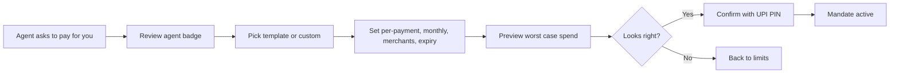
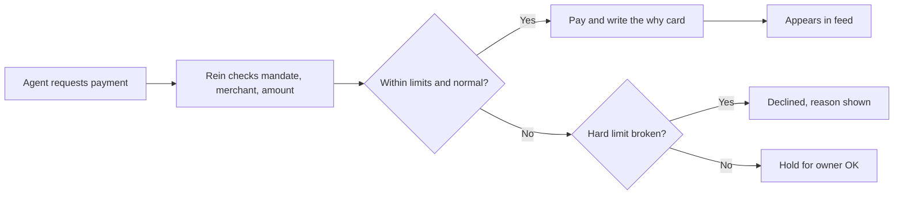
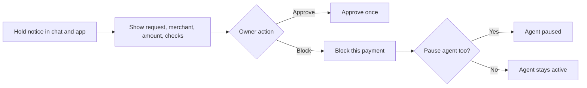
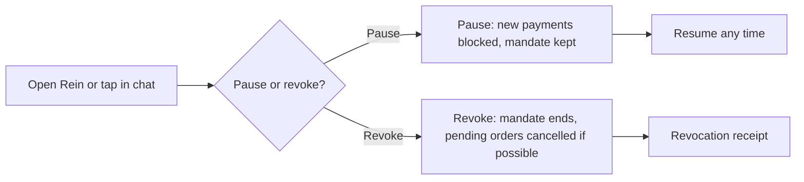
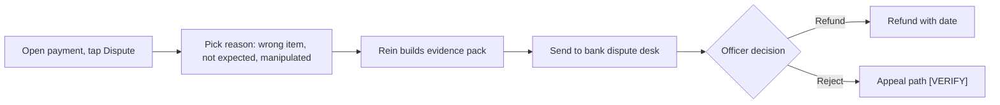
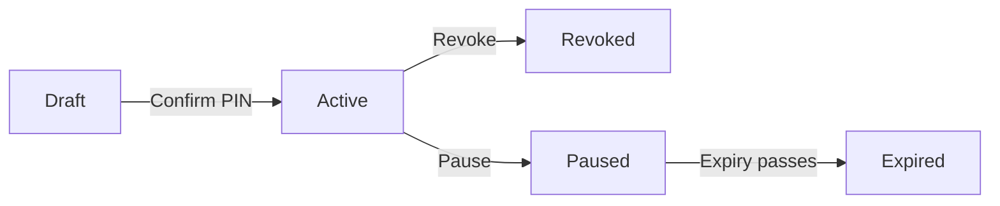
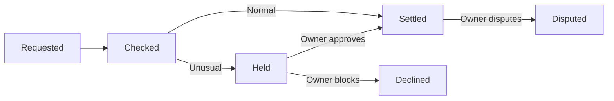

# P1 Rein · Develop

## Core task flows
_Five flows and two state machines._ [Ready for review]

Flow 1 · Create a mandate

Flow 2 · Agent pays inside the mandate

Flow 3 · Anomaly hold

Flow 4 · Pause or revoke

Flow 5 · Dispute within limits

State machine · Mandate

State machine · Payment

