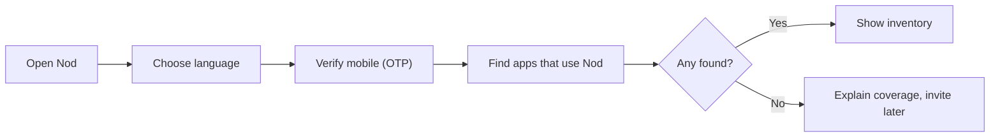
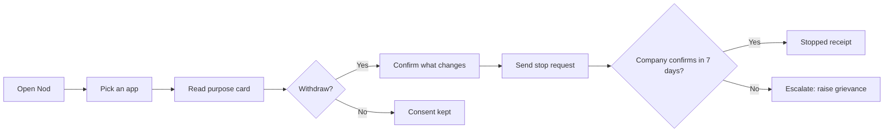
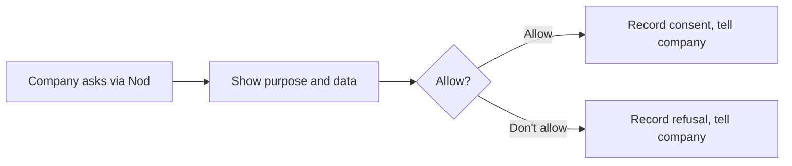
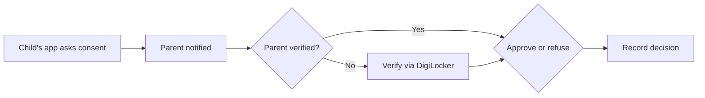
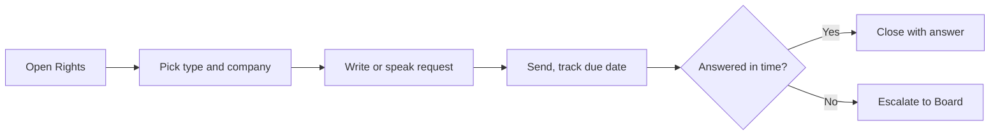
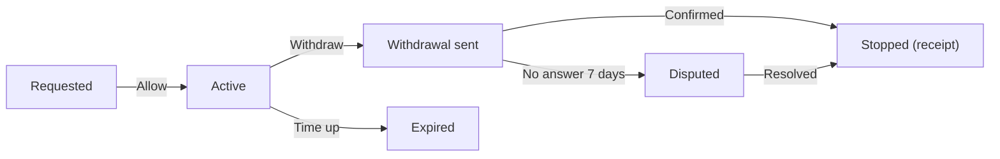

# P2 Nod · Develop

## Core task flows
_Five flows and the state machine of a Consent._ [Ready for review]

Flow 1 · Link apps (first run)

Flow 2 · Withdraw with proof

Flow 3 · New consent request

Flow 4 · Guardian approves a child's consent

Flow 5 · Rights request

State machine · Consent

