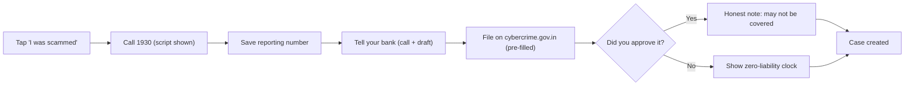
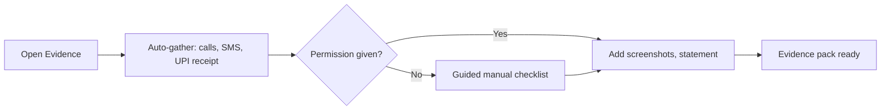
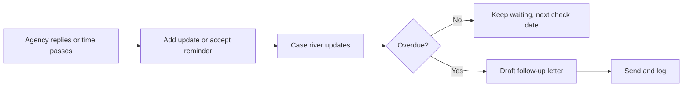
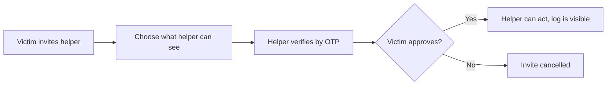
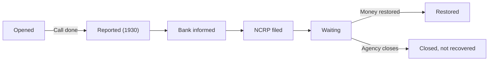
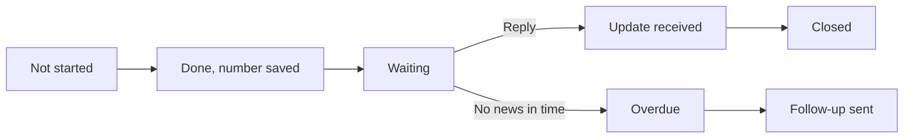

# P3 Mend · Develop

## Core task flows
_Four flows and two state machines._ [Ready for review]

Flow 1 · First hour

Flow 2 · Evidence

Flow 3 · Track the case

Flow 4 · Family helper

State machine · Case

State machine · Channel report

