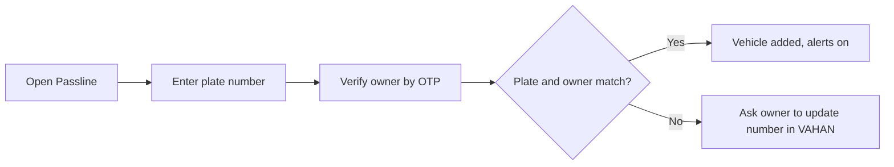
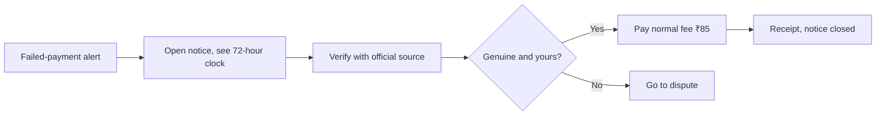
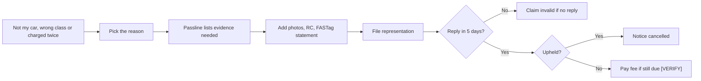
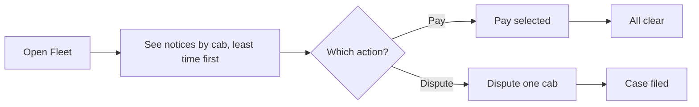
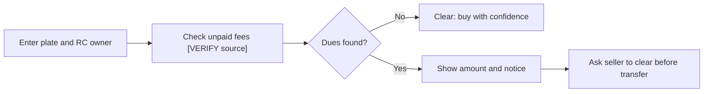
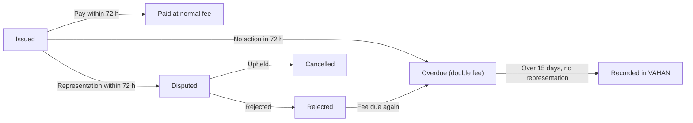

# P4 Passline · Develop

## Core task flows
_Five flows and the Notice state machine._ [Ready for review]

Flow 1 · Add a vehicle

Flow 2 · Alert, verify, pay

Flow 3 · Dispute inside 72 hours

Flow 4 · Fleet clear-up

Flow 5 · Check a used car

State machine · Notice

