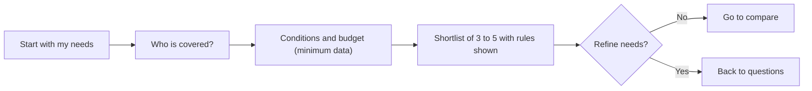
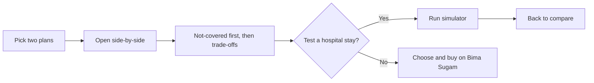
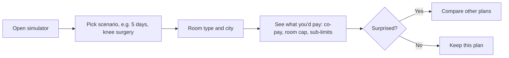
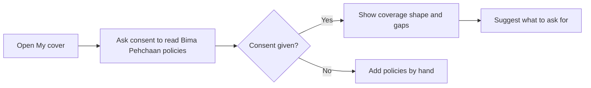
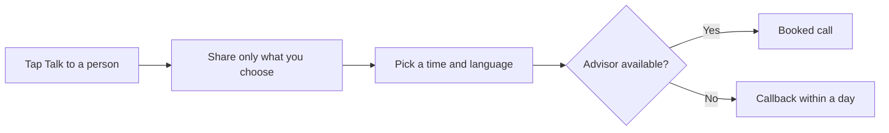
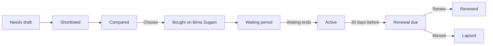

# P5 Fineprint · Develop

## Core task flows
_Five flows and the policy state machine._ [Ready for review]

Flow 1 · Start with my needs

Flow 2 · Compare two plans

Flow 3 · Hospital-stay simulator

Flow 4 · Gap check with my existing cover

Flow 5 · Talk to a licensed advisor

State machine · Policy

