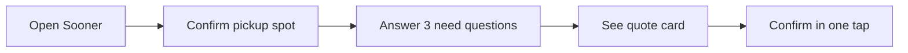
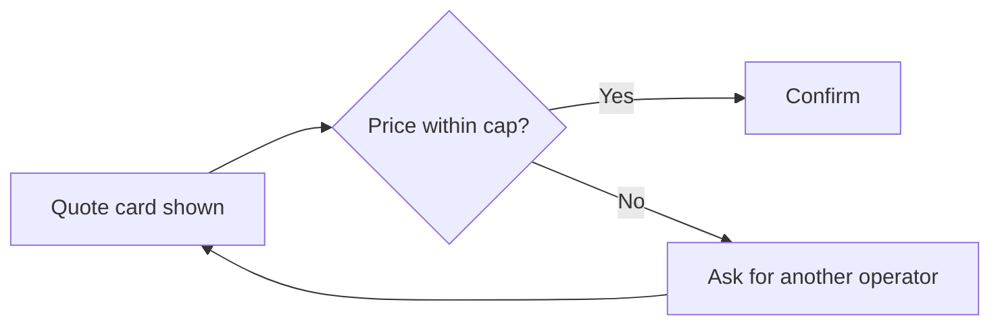
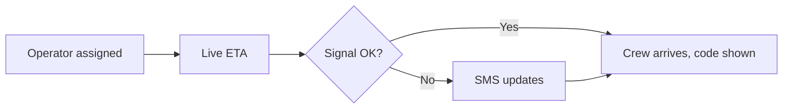
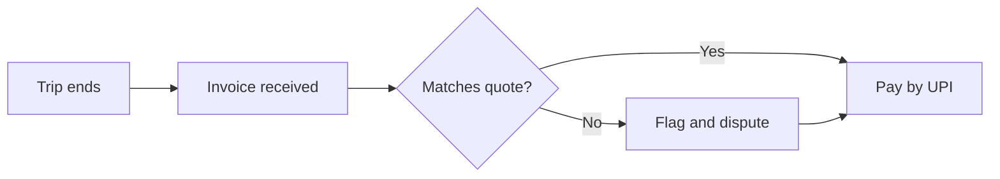
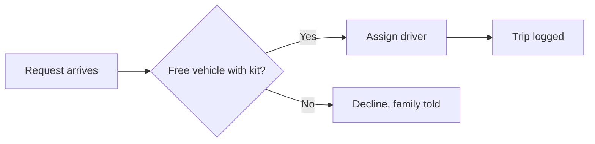
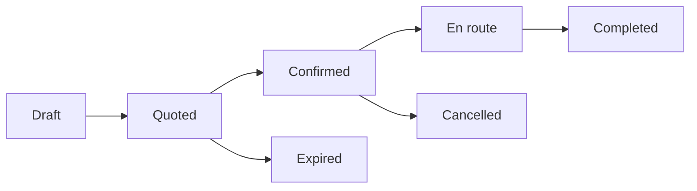

# P6 Sooner · Develop

## Core task flows
_Five flows and the request state machine._ [Ready for review]

Flow 1 · Ask for help

Flow 2 · Quote and confirm

Flow 3 · Track and arrive

Flow 4 · Pay and check

Flow 5 · Operator dispatch

Request state machine

