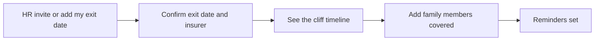
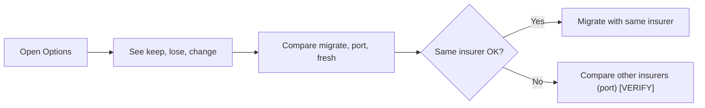
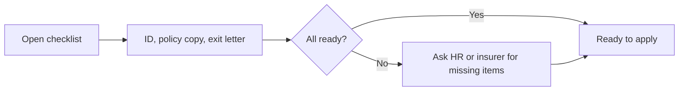
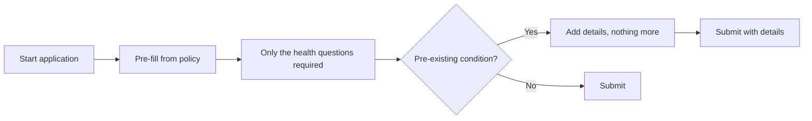
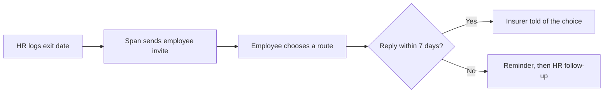
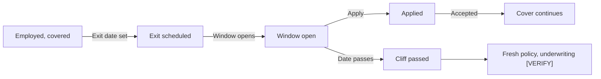

# P7 Span · Develop

## Core task flows
_Five flows and the cover state machine._ [Ready for review]

Flow 1 · See my cliff

Flow 2 · Choose a route

Flow 3 · Prepare documents

Flow 4 · Apply with minimal health data

Flow 5 · HR exit workflow

State machine · Cover transition

