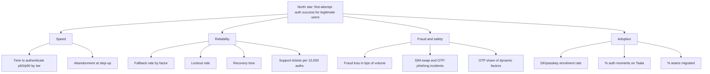

# Metrics

Baselines are **to be measured**. Targets are **target** (Orbit is fictional).

## Tree

## Definitions
| Metric | Definition | Baseline | Target | Events |
|---|---|---|---|---|
| First-attempt success (North star) | Legit auths passed on first factor try / all legit auths | to be measured | ≥ 95% Low, ≥ 90% Medium/High | `taala_auth_started`, `taala_factor_result` |
| Time to authenticate | Sheet open → success, p50/p90 per tier | to be measured | Low p50 ≤ 3 s | `taala_sheet_opened`, `taala_auth_succeeded` |
| Abandonment at step-up | Step-up shown → sheet closed without success | to be measured | −20% vs legacy (H1) | `taala_stepup_shown`, `taala_sheet_dismissed` |
| Fallback rate by factor | Fallback chosen / factor attempts | to be measured | BIO < 10% | `taala_fallback_chosen` |
| OTP share | OTP as dynamic factor / all dynamic factors | to be measured (est. > 80%) | < 30% by end Phase 3 | `taala_factor_result{factor=OTP}` |
| Enrolment rate | Users with DK or passkey / active users | to be measured | 60% in 6 months | `taala_enrol_completed` |
| Fraud loss | Confirmed fraud ₹ / volume ₹, in bps | to be measured | −30% | Risk data |
| SIM-swap / OTP-phishing incidents | Count per month | to be measured | −50% | Risk data |
| Lockout rate | Lockouts / active users / month | to be measured | −25% | `taala_lockout` |
| Recovery time | Lockout → regained access, median | to be measured | < 10 min self-serve | `taala_recovery_completed` |
| Support tickets | Auth tickets per 10,000 auths | to be measured | −20% | Support system |
| Adoption | Moments on Taala / all moments; teams migrated / 5 | 0% | 95% / 5 of 5 | Engine logs |

## Guardrails (stop or roll back if breached)
- Fraud loss up > 10% vs control for 2 weeks.
- First-attempt success down > 2 points vs control.
- Lockout rate up > 15%.
- Any a11y blocker (screen-reader user can't finish a payment).
- Engine p99 latency > 300 ms.
