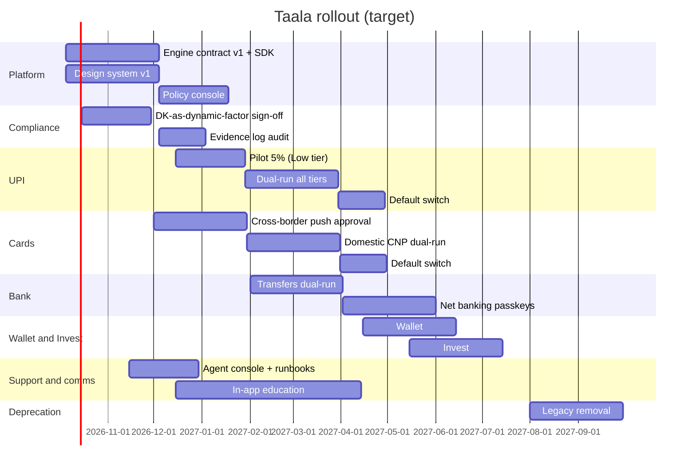

# Rollout timeline

Quarters are a plan (target), starting Q3 FY27 (Oct 2026).

## Gates
| Gate | When | Who decides | Evidence |
|---|---|---|---|
| G0 Foundations ready | end Nov 2026 | Auth Council | Contract, components, compliance memo |
| G1 Pilot go | mid Dec 2026 | Auth Council + UPI lead | Kill switch drill, dashboards live |
| G2 Dual-run go | Feb 2027 | Auth Council | Pilot metrics vs guardrails |
| G3 Default switch | per product | Product lead + Risk + Compliance | 4 weeks dual-run within guardrails |
| G4 Deprecation | Aug 2027 | Auth Council | 95% of moments on Taala |

## Owners
Platform (engine, SDK, components) · UPI, Cards, Bank, Wallet, Invest product teams · Risk (rules, thresholds) · Compliance (sign-off, evidence) · Support (console, runbooks) · Marketing/comms (in-app education, no launch campaign).
