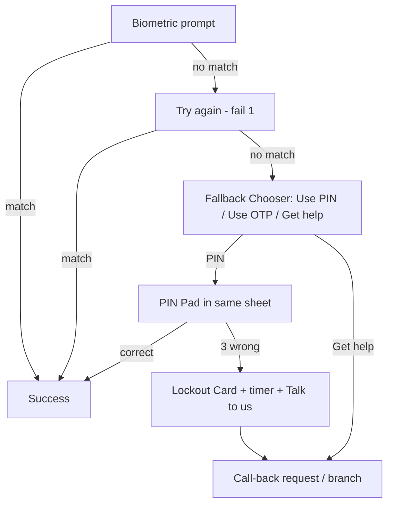
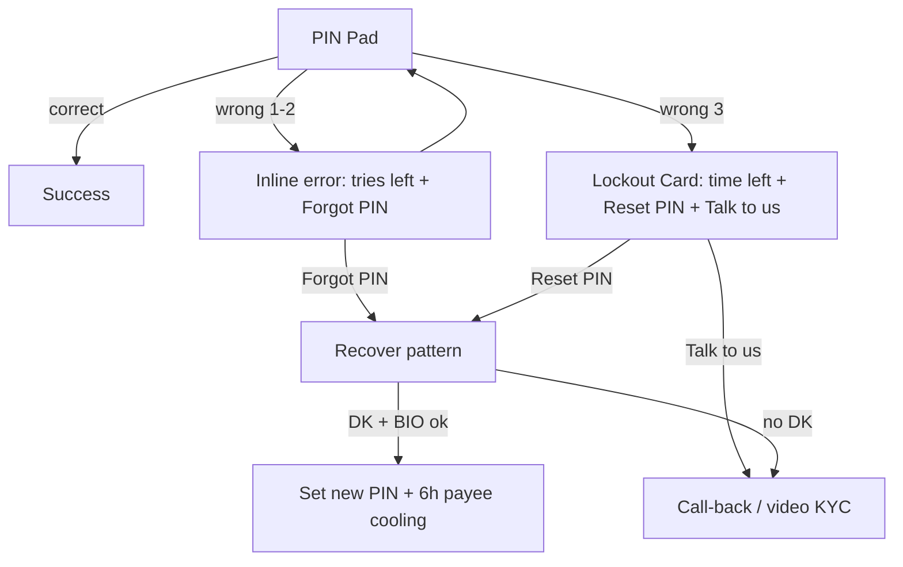
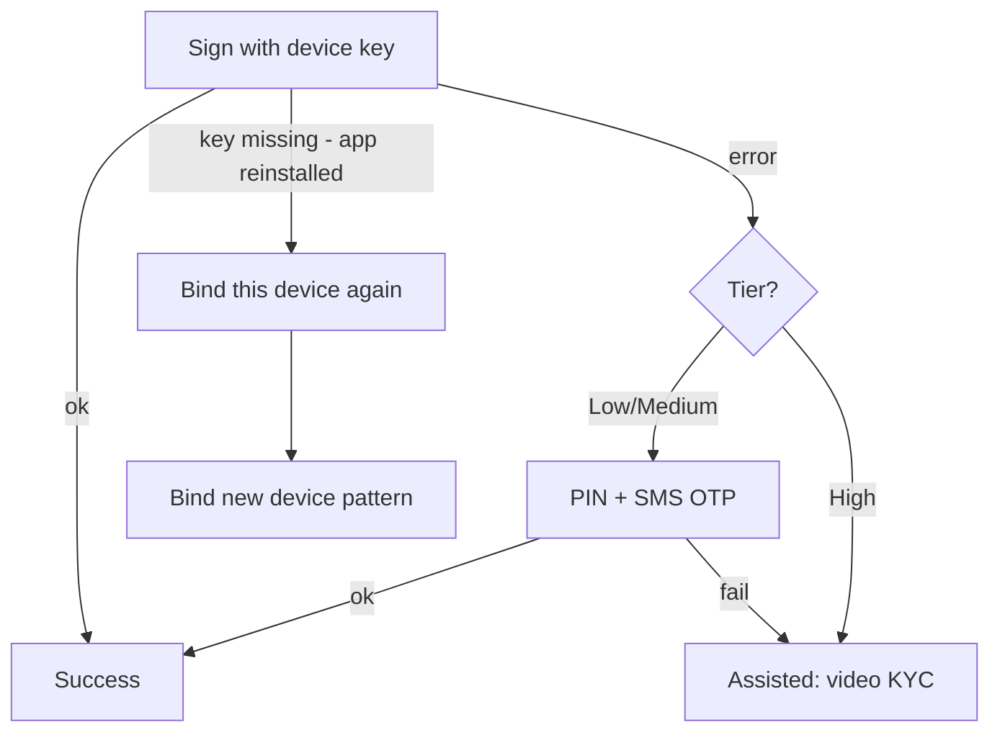
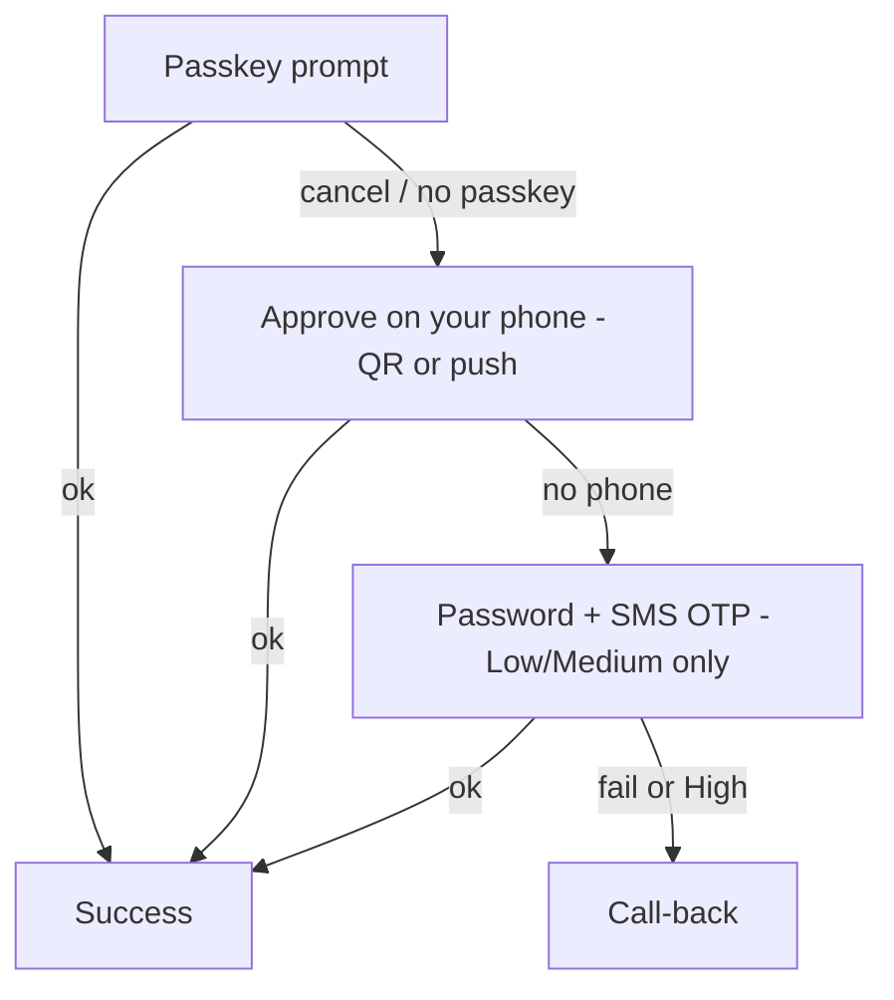
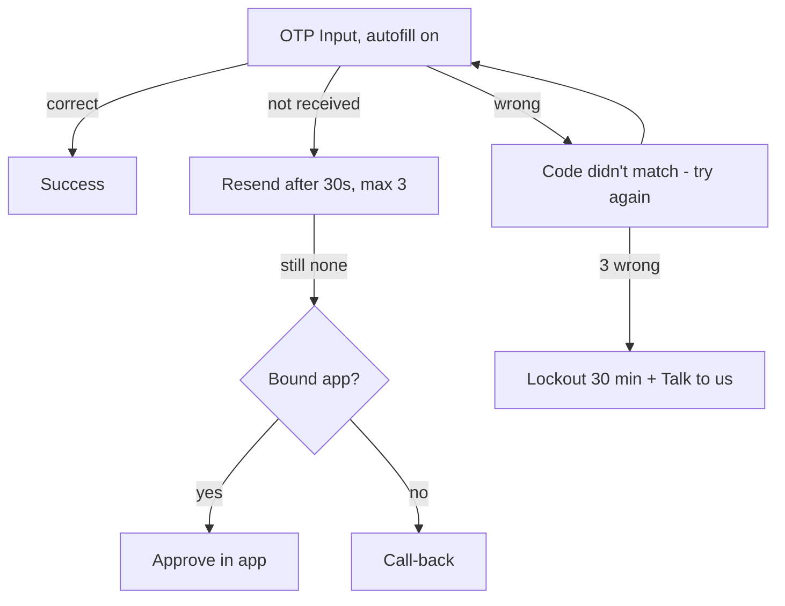

# Fallback ladder

Rule: **every path ends with a person.** Attempt limits are Orbit policy (tunable within the a11y floor: never fewer than 2 tries before offering another option).

## Summary per primary factor

| Primary | Fail 1 | Fail 2 | Then | Lockout | Human route |
|---|---|---|---|---|---|
| Biometric (BIO) | Inline "Didn't match. Try again." | Fallback Chooser opens: PIN first | After 5 total BIO fails: BIO off for this session | None (PIN still works) | — |
| App PIN / UPI PIN | "Wrong PIN. 2 tries left." | "1 try left." + "Forgot PIN?" | 3rd fail → Lockout | 24 h (UPI PIN per NPCI/issuer [VERIFY]); app PIN 30 min, then 24 h on repeat | Reset PIN (Recover pattern) or call-back |
| Device key (DK) | Silent retry once | "We can't reach your phone's secure key" → PIN + OTP (Low/Medium only) | High tier → assisted | — | Re-bind device or video KYC |
| Passkey (PK) | Retry / choose another passkey | "Approve on your phone" (DK push) | Password + OTP (Low/Medium) | — | Call-back |
| SMS OTP | "Code didn't match." | Resend after 30 s (max 3) | Switch to "Approve in app" if bound; else voice OTP [VERIFY] | 3 wrong codes → 30 min | Call-back |

## Flows

### Biometric

### PIN (app PIN or UPI PIN)

### Device-bound key

### Passkey (net banking)

### SMS OTP

## Special cases

| Case | Detection | Behaviour | Message ID |
|---|---|---|---|
| No biometric hardware / unreadable fingerprint | OS reports none or 5+ fails | Offer "Use PIN every time" setting; no nagging to re-enrol | MSG_BIO_NONE |
| Screen-reader user | OS a11y service on | Same flow; timers paused while TalkBack speaks; "I need more time" on every timer; PIN pad digits announced as "Digit entered, 3 of 6", never the digit | MSG_A11Y_MORE_TIME |
| No mobile data | No network | UPI Lite / offline small-value only (exempt, UPI-10); else queue with "We'll send when you're back online" — never silently retry money movement | MSG_OFFLINE |
| No SIM signal (NRI) | SIM absent | Use DK push over Wi-Fi; never send OTP to a known-dead SIM first | MSG_SIM_ABSENT |
| SIM swap in last 48 h | Telco signal / device | Daily limit ₹5,000; High tier for any new payee; new device bind Blocked → video KYC | MSG_SIM_CHANGED |
| New device | No DK on device | Bind new device pattern; 12 h new-payee lock | MSG_NEW_DEVICE |
| Shared family phone | Multiple OS users / user declares | Per-person app profile with own PIN; receiving works for all, sending needs profile PIN | MSG_SHARED_PHONE |
| User abroad | Geo + roaming + card abroad | Medium for cross-border; push approval; Trust Meter "Payment abroad" | MSG_ABROAD |
| App reinstalled | DK missing, account known | Treated as new device | MSG_REINSTALL |
| Social engineering suspected | Active call during A2+ transfer; screen-sharing app running | 30 s pause, scam warning, "Cancel" as primary button | MSG_ON_CALL |

## Error and recovery messages

Hindi and Kannada are drafts: **[VERIFY with native speaker]**.

| ID | Trigger | English | Hindi [VERIFY] | Kannada [VERIFY] | Tone |
|---|---|---|---|---|---|
| MSG_BIO_RETRY | 1st biometric fail | Didn't match. Try again. | मेल नहीं खाया। फिर से कोशिश करें। | ಹೊಂದಿಕೆಯಾಗಲಿಲ್ಲ. ಮತ್ತೆ ಪ್ರಯತ್ನಿಸಿ. | Calm, no blame |
| MSG_BIO_FALLBACK | 2nd biometric fail | Let's try another way. | चलिए दूसरा तरीका आज़माएँ। | ಬೇರೆ ವಿಧಾನ ಪ್ರಯತ್ನಿಸೋಣ. | Helpful |
| MSG_PIN_WRONG | Wrong PIN, tries left | Wrong PIN. {n} tries left. | गलत PIN। {n} कोशिशें बाकी। | ತಪ್ಪು PIN. ಇನ್ನೂ {n} ಪ್ರಯತ್ನಗಳಿವೆ. | Factual |
| MSG_LOCKED | PIN lockout | For your safety, PIN is paused for {time}. You can reset it now or talk to us. | आपकी सुरक्षा के लिए PIN {time} के लिए रोका गया है। अभी रीसेट करें या हमसे बात करें। | ನಿಮ್ಮ ಸುರಕ್ಷತೆಗಾಗಿ PIN ಅನ್ನು {time} ನಿಲ್ಲಿಸಲಾಗಿದೆ. ಈಗ ಮರುಹೊಂದಿಸಿ ಅಥವಾ ನಮ್ಮೊಂದಿಗೆ ಮಾತನಾಡಿ. | Reassuring, gives 2 ways out |
| MSG_OTP_NEVER_SHARE | OTP screen | Never share this code. Orbit will never ask for it. | यह कोड किसी को न बताएँ। Orbit कभी नहीं पूछेगा। | ಈ ಕೋಡ್ ಯಾರಿಗೂ ಹೇಳಬೇಡಿ. Orbit ಎಂದಿಗೂ ಕೇಳುವುದಿಲ್ಲ. | Firm |
| MSG_OTP_RESEND | OTP not received | Didn't get it? Resend in {s}s. | नहीं मिला? {s} सेकंड में दोबारा भेजें। | ಬರಲಿಲ್ಲವೇ? {s} ಸೆಕೆಂಡ್‌ನಲ್ಲಿ ಮತ್ತೆ ಕಳುಹಿಸಿ. | Neutral |
| MSG_SIM_CHANGED | SIM change < 48 h | Your SIM changed recently, so we're being careful for 2 days. | आपका SIM हाल ही में बदला है, इसलिए हम 2 दिन सावधानी रख रहे हैं। | ನಿಮ್ಮ SIM ಇತ್ತೀಚೆಗೆ ಬದಲಾಗಿದೆ, ಆದ್ದರಿಂದ 2 ದಿನ ಎಚ್ಚರಿಕೆ ವಹಿಸುತ್ತಿದ್ದೇವೆ. | Explain, don't accuse |
| MSG_ON_CALL | Active call + transfer | Is someone on the phone asking you to pay? Banks never ask you to move money on a call. | क्या फोन पर कोई आपसे पैसे भेजने को कह रहा है? बैंक कभी कॉल पर पैसे भेजने को नहीं कहता। | ಫೋನ್‌ನಲ್ಲಿ ಯಾರಾದರೂ ಹಣ ಕಳುಹಿಸಲು ಹೇಳುತ್ತಿದ್ದಾರೆಯೇ? ಬ್ಯಾಂಕ್ ಎಂದಿಗೂ ಕರೆಯಲ್ಲಿ ಹಣ ಕಳುಹಿಸಲು ಹೇಳುವುದಿಲ್ಲ. | Direct, caring |
| MSG_SIM_ABSENT | No SIM | No Indian SIM? Approve in this app instead. | भारतीय SIM नहीं है? इस ऐप में मंज़ूरी दें। | ಭಾರತೀಯ SIM ಇಲ್ಲವೇ? ಈ ಆ್ಯಪ್‌ನಲ್ಲೇ ಅನುಮೋದಿಸಿ. | Practical |
| MSG_OFFLINE | No data | You're offline. Small payments still work. Others will wait until you're back. | आप ऑफ़लाइन हैं। छोटे भुगतान अभी भी होंगे। बाकी नेटवर्क आने पर। | ನೀವು ಆಫ್‌ಲೈನ್‌ನಲ್ಲಿದ್ದೀರಿ. ಸಣ್ಣ ಪಾವತಿಗಳು ಆಗುತ್ತವೆ. ಉಳಿದವು ನೆಟ್‌ವರ್ಕ್ ಬಂದಾಗ. | Calm |
| MSG_NEW_DEVICE | New device | New phone? Let's set it up safely. Takes about 2 minutes. | नया फोन? इसे सुरक्षित रूप से सेट करें। लगभग 2 मिनट। | ಹೊಸ ಫೋನ್? ಸುರಕ್ಷಿತವಾಗಿ ಹೊಂದಿಸೋಣ. ಸುಮಾರು 2 ನಿಮಿಷ. | Welcoming |
| MSG_BLOCKED_ASSIST | Blocked tier | We need to check this with you on a short video call. Pick a time. | हमें एक छोटी वीडियो कॉल पर आपसे यह जाँचना है। समय चुनें। | ಇದನ್ನು ಸಣ್ಣ ವೀಡಿಯೊ ಕರೆಯಲ್ಲಿ ಪರಿಶೀಲಿಸಬೇಕು. ಸಮಯ ಆರಿಸಿ. | Respectful |
| MSG_A11Y_MORE_TIME | Any timer | Need more time? | और समय चाहिए? | ಇನ್ನಷ್ಟು ಸಮಯ ಬೇಕೆ? | Neutral |
| MSG_BIO_NONE | No biometrics | No problem. You can use your PIN every time. | कोई बात नहीं। आप हर बार PIN इस्तेमाल कर सकते हैं। | ಪರವಾಗಿಲ್ಲ. ಪ್ರತಿ ಬಾರಿ PIN ಬಳಸಬಹುದು. | Inclusive |
| MSG_SHARED_PHONE | Shared phone | Only your PIN can send money. Anyone can receive. | केवल आपका PIN पैसे भेज सकता है। पैसे कोई भी पा सकता है। | ನಿಮ್ಮ PIN ಮಾತ್ರ ಹಣ ಕಳುಹಿಸಬಹುದು. ಯಾರಾದರೂ ಸ್ವೀಕರಿಸಬಹುದು. | Clear |

## Lockout and recovery security
1. **No OTP-only recovery** for PIN reset, device bind, adding payees or raising limits (ADR-006). Recovery needs DK on a bound device + BIO, or a card/debit check + OTP + BIO enrol, or assisted video KYC.
2. **Cooling after recovery:** 6 h no new payees; notifications to all bound devices and email.
3. **SIM change + new device = Blocked** in-app; assisted only.
4. **Support never asks for OTP or PIN.** Agent console shows the reason and offers safe actions (send secure link to bound app, book video KYC).
5. **Rate limits** on recovery attempts per account and per device (tunable).
6. **Every recovery is logged** with factors, for compliance (R16).
